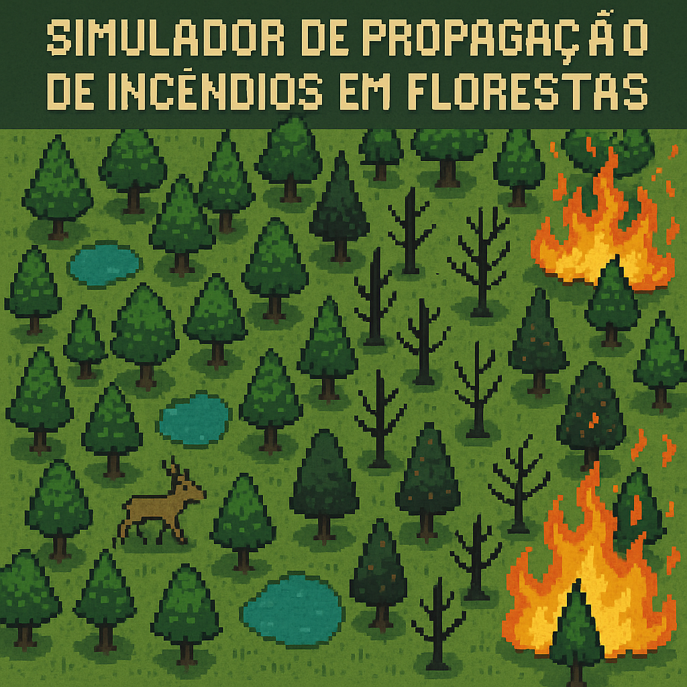

<div align="center">
  
</div>

Este repositório contém a implementação de um simulador de propagação de incêndios em florestas, desenvolvido como parte de um trabalho acadêmico. O objetivo principal é modelar a propagação do fogo em uma matriz que representa a floresta, utilizando a linguagem de programação C++. Adicionalmente, o simulador é capaz de identificar rotas de fuga para um animal presente na floresta.

<p align="center">
  <a href="#descrição-do-problema">📘 Descrição do Problema</a> •
  <a href="#especificação-do-trabalho">📋 Especificação do Trabalho</a> •
  <a href="#compilação-e-execução">🛠️ Compilação e Execução</a> •
  <a href="#entrada-e-saída-de-dados">📂 Entrada e Saída de Dados</a> •
  <a href="#arquivo-de-configuração-(`config.hpp`)">⚙️ Arquivo de Configuração</a> •
  <a href="#metodologia-do-código">🔍 Metodologia do Código</a> •
  <a href="#padrões-de-propagação-e-análise">📊 Padrões de Propagação e Análise</a> •
  <a href="#possíveis-melhorias">💡 Possíveis Melhorias</a> •
  <a href="#estrutura-do-repositório">📁 Estrutura do Repositório</a> •
  <a href="#licença">📝 Licença</a>
</p>

## Descrição do Problema

O simulador utiliza uma matriz dinâmica para representar a floresta. Cada célula da matriz pode conter os seguintes valores, que indicam o estado correspondente:
- **0**: Área segura (não queima)
- **1**: Árvore saudável
- **2**: Árvore em chamas
- **3**: Árvore queimada (não propaga mais fogo)
- **4**: Água

A simulação consiste em iterar sobre a matriz para propagar o incêndio e deslocar um animal até que o fogo se extinga ou o número máximo de iterações seja alcançado.

## 📝Especificação do Trabalho

### Requisitos

- Implementação em C++.
- Modularização do código com headers (`.hpp`) e arquivos de implementação (`.cpp`).
- Configuração global através de um arquivo `config.hpp`.
- Entrada de dados a partir de `input.dat` e saída escrita em `output.dat`.
- Simulação iterativa e visual, exibindo o estado da floresta em cada iteração no arquivo de saída.
- Compatibilidade com sistema Linux e compilação com `make`.

### ✨Funcionalidades

1. Representação da floresta como matriz dinâmica.
2. Propagação do fogo com e sem influência do vento.
3. Movimentação de um animal buscando rotas de fuga.
4. Relatório de desempenho e análise ao final da simulação.

## Compilação e Execução

Utilize os seguintes comandos no terminal para compilar e executar o simulador:

1. Limpar arquivos antigos:
   ```bash
   make clean
   ```
2. Compilar o código:
   ```bash
   make
   ```
3. Executar o simulador:
   ```bash
   make run
   ```

## Entrada e Saída de Dados

### Arquivo de Entrada (`input.dat`)

O arquivo `input.dat` deve conter:
- Dimensões da matriz (N x M).
- Coordenadas iniciais do incêndio.
- Matriz da floresta, linha por linha.
- Todos os dados separados por espaço.

#### Exemplo:
```
5 5 1 1
1 1 1 1 4
1 2 1 1 1
1 1 1 1 4
0 0 1 1 1
1 4 1 0 4
```

### Arquivo de Saída (`output.dat`)

A cada iteração, o estado atualizado da matriz será escrito no arquivo `output.dat`.

#### Exemplo:
```
Interação 0:           Interação 1:           Interação 2:           Interação 3:           Interação 4:           Interação 5:           Interação 6:           Interação 7:

1 1 1 1 4              1 2 1 1 4              2 2 2 1 4              2 3 2 2 0              3 3 3 2 0              3 3 3 3 0              3 3 3 3 0              3 3 3 3 0    
1 2 1 1 1              2 2 2 1 1              2 3 2 2 1              3 3 3 2 2              3 3 3 3 2              3 3 3 3 3              3 3 3 3 3              3 3 3 3 1    
1 1 1 1 4              1 2 1 1 4              2 2 2 1 4              2 3 2 2 4              3 3 3 2 4              3 3 3 3 4              3 3 3 3 4              3 3 3 1 0    
0 0 1 1 1              0 0 1 1 1              0 0 1 1 1              0 0 2 1 1              0 0 2 2 1              0 0 3 2 2              0 0 3 3 2              0 0 3 3 3    
1 4 1 0 4              1 4 1 0 4              1 4 1 0 4              1 4 1 0 4              1 4 2 0 4              1 4 2 0 4              1 4 3 0 4              1 4 3 0 4    
```

Após a finalização das interações será escrito no arquivo `output.dat` o relatório da simulação:

#### Exemplo:
```
----------------------------------------
Animal sobreviveu
Animal na posição: (2, 4)
Passos: 6, Encontrou água: 2
O vento estava ativo nas direções:
 Sul
 Norte
 Leste
 Oeste
----------------------------------
```

## Arquivo de Configuração (`config.hpp`)

O arquivo `config.hpp` permite configurar globalmente parâmetros importantes para a simulação, como a propagação do fogo com ou sem vento, as direções do vento e o número máximo de interações permitidas.

#### Configurações Disponíveis
1. **Habilitar ou Desabilitar o Vento**
   - A configuração `VENTO` permite ativar (`true`) ou desativar (`false`) a influência do vento na propagação do incêndio.

2. **Direções do Vento**
   - As direções (`SUL`, `NORTE`, `LESTE`, `OESTE`) especificam para onde o vento direciona a propagação do fogo. Cada direção pode ser ativada (`true`) ou desativada (`false`) individualmente.

3. **Número Máximo de Interações**
   - A configuração `interacoes` define o limite máximo de iterações da simulação. Após atingir esse valor, a execução será finalizada automaticamente.

#### Estrutura do Arquivo

```cpp
#define VENTO true          // Ativa ou desativa o vento na simulação

#define SUL true            // Permite propagação para o sul
#define NORTE true          // Permite propagação para o norte
#define LESTE true          // Permite propagação para o leste
#define OESTE true          // Permite propagação para o oeste

#define interacoes 1000     // Número máximo de interações da simulação
```

#### Observação
- Caso `VENTO` esteja configurado como `false`, as variáveis `SUL`, `NORTE`, `LESTE` e `OESTE` serão ignoradas.
- Alterações nesse arquivo devem ser realizadas antes da compilação do programa.

## Metodologia do Código

### Arquivo Principal: `Simulacao.cpp`

O arquivo principal da simulação é o `Simulacao.cpp`. Ele contém a função `executarSimulacao`, que é responsável por organizar e executar os passos da simulação. Abaixo está a ordem geral de execução:

#### 1. Preparação Inicial:
- Limpa o arquivo de saída (`limparSaida()`).
- Lê o arquivo de entrada e inicializa a floresta (`lerArquivo()`).
- Cria um objeto `Incendio` com a posição inicial do fogo.
- Inicializa a matriz da floresta e o objeto `Animal`.

#### 2. Posicionamento do Animal:
- O animal é colocado na primeira posição segura (0 ou 1) disponível na matriz.

#### 3. Execução do Loop da Simulação:
O loop principal é controlado por um contador de interações e uma variável de controle (`matrizQueimada`). A cada iteração:
- O animal se move, caso ainda esteja vivo (`animal.mover()`).
- O incêndio se propaga na matriz (`incendio.propagarIncendio()`).
- Verifica-se se o animal sobreviveu ou morreu, com uma tentativa de escapar caso esteja na mesma posição que o fogo.
- Adiciona o estado da matriz e a iteração no `output.dat`.

#### 4. Finalização:
- Quando o loop termina, é gerado um relatório final da simulação (`gerarRelatorio()`).

---

### Método de Movimento do Animal (`mover()`)

O método `mover` está implementado na classe `Animal`, em `Animal.cpp`. Ele define como o animal se desloca na matriz com base em prioridades.

#### 1. Classificação de Movimentos:
O método avalia as posições ortogonais ao animal. Prioridades:
- **Água** (código `4` na matriz): Melhor movimento.
- **Áreas seguras** (código `0` ou `1`): Movimentos intermediários.
- **Floresta Queimada** (código `3`): Movimentos ruins.
- **No caso de só ter posições de fogo em sua volta** (código `2`): Continua na mesma posição.

#### 2. Movimento Decidido:
- Se o animal estiver em uma posição segura (código `0`), ele pode ficar parado por até 3 iterações.
- Caso contrário, ele se move para a melhor posição disponível, atualizando sua posição na matriz.
- No caso de 2 opções de movimento com a mesma prioridade, é decidido de forma aleatória sua movimentação.

---

### Método de Propagação do Incêndio (`propagarIncendio`)

O método `propagarIncendio` está implementado na classe `Incendio`, em `Incendio.cpp`. Ele define como o fogo se espalha na matriz.

#### 1. Atualização da Matriz:
- Marca as posições anteriormente queimadas como áreas carbonizadas (código `3`).
- Atualiza as posições atuais do fogo.

#### 2. Propagação do Fogo:
- **Se o vento estiver ativo** (`VENTO` definido como `true`):
    - O fogo se propaga nas direções configuradas (NORTE, SUL, LESTE, OESTE).
- **Caso contrário**, o fogo se espalha para todas as posições adjacentes.

#### 3. Verificação de Condição Final:
- Retorna `true` se todas as posições possíveis já foram queimadas, indicando o fim da propagação.

## Padrões de Propagação e Análise

### Sem Vento
O fogo se propaga em todas as direções ortogonais, resultando em uma expansão simétrica quando não há obstáculos.

Exemplo visual:
🔥 = fogo | 🌿 = vegetação |

| Estado Inicial | Após 1 iteração |
|----------------|-----------------|
| 🌿 🌿 🌿 | 🌿 🔥 🌿 |
| 🌿 🔥 🌿 | 🔥 🔥 🔥 |
| 🌿 🌿 🌿 | 🌿 🔥 🌿 |

### Com Vento
A propagação é direcionada, resultando em padrões assimétricos que dependem da configuração do vento.

Exemplo visual:
🔥 = fogo | 🌿 = vegetação |

| Estado Inicial | Após 1 iteração (leste, sul) |
|----------------|------------------------------|
| 🌿 🌿 🌿 | 🌿 🌿 🌿 |
| 🌿 🔥 🌿 | 🌿 🔥 🔥 |
| 🌿 🌿 🌿 | 🌿 🔥 🌿 |

### Análise
O simulador permite prever o potencial de destruição do incêndio ao observar o número de iterações e a área afetada.

## Possíveis Melhorias

- Implementação de algoritmos de busca melhores como BFS, Dijkstra, entre outros.
- Implementar visualização gráfica.
- Adicionar múltiplos animais.

## Estrutura do Repositório

```
Trabalho_Aquecimento/
├── src/
│   ├── main.cpp
│   ├── config.hpp
│   ├── animal.cpp
│   ├── fire.cpp
│   ├── matrix.cpp
│   └── ...
├── input.dat
├── output.dat
├── Makefile
└── README.md
```

## Licença

Este projeto foi desenvolvido para fins acadêmicos e está disponível sob a licença MIT.
